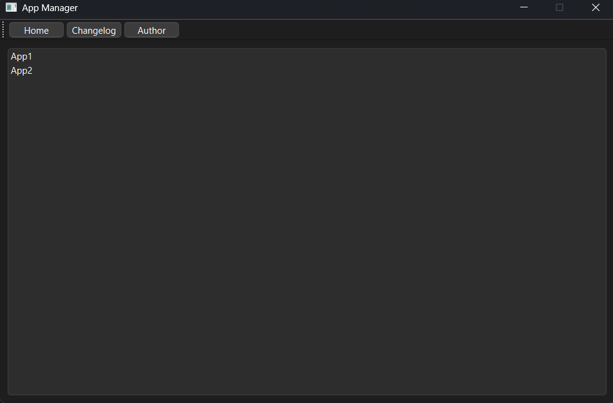

               

# App-Manager

App Manager is a robust desktop application designed to streamline software management. It allows users to download and configure software based on personal preferences, building a customized software environment that enhances productivity.

## 📸 Quick Look

Get a glimpse of App Manager in action:

## 🖥️ Platform Support
| Platform  | Supported       | 📅 Version       | Description                            |
|-----------|------------------|------------------|----------------------------------------|
| **Windows** | **Supported**    | 0.1.0-alpha      | Fully operational with a comprehensive feature set tailored for Windows users. features.  |
| **Linux**   | **Not in Development** | Unreleased       | Currently not in development; future plans may include Linux support. |
| **macOS**   | **Not Supported** | Unreleased       | Currently not supported, but potential development may begin in the future. |

## ✨ Features
| Feature                  | Description |
|--------------------------|-------------|
| **Custom Software Configuration** | Easily adjust settings to fit your requirements for optimal performance. |
| **Streamlined Download Process**  | Quickly download software with minimal steps, eliminating the hassle of manual installations. |
| **User-Friendly Interface**       | Enjoy a clean and intuitive interface that simplifies software management. |
| **Cross-Platform Support**        | Stable support for Windows, with macOS and Linux versions actively in development. |
| **Manual Configuration**          | Manage software environments flexibly by adding software and specifying configurations through JSON files. |
| **Regular Updates**               | Stay current with the latest features and improvements through frequent software updates. |

## 🚀 Getting Started

1. **Install the App**: Download App Manager from the [official source]().
3. **Launch the Application**: Open App Manager to access its intuitive interface.
4. **Configure Your Software**: Choose software to download and set custom configuration preferences.
5. **Download and Install**: Click "Download" to start the installation, letting App Manager handle the process.

## 📜 Usage
App Manager allows custom configurations for software installations, reducing complex setups. The user-friendly interface facilitates inputting preferences and managing software effectively.

## 📚 Documentation

Comprehensive documentation is available with detailed instructions, troubleshooting tips, and FAQs. Access the [Documentation](/docs/Documentation.md) to make the most of App Manager.

### 🛠️ Configuration

App Manager supports both manual and JSON-based configuration for a fully tailored experience. Check the [Configuration Documentation](/docs/Configuration.md) for a step-by-step guide.

## ✅ Prerequisites
| Requirement           | Description                                           |
|-----------------------|-------------------------------------------------------|
| **Operating System**  | Confirm that your OS is compatible.                   |
| **Dependencies**      | Ensure required dependencies are installed.           |
| **Disk Space**        | 20-50 MB of free space needed.                        |
| **Network**           | Stable internet connection recommended for downloads. |

## 🐞 Troubleshooting

If you encounter issues while using App Manager, please refer to the following:
- [FAQ](/docs/FAQ.md): Find answers to common questions and solutions.
- [Documentation](/docs/Documentation.md): In-depth guidance on using the application.
- [Github Issues](https://github.com/Lei0x1/App-Manager/issues): For unresolved issues, please open an issue on GitHub.

## 💡 Contributing
We welcome contributions from the community! Here are ways you can help improve the project:
| Type | Description |
|------|-------------|
| **Bug Reports** | Report issues to help us identify and fix bugs. |
| **Feature Requests** | Suggest new features or enhancements. |
| **Code Contributions** | Submit pull requests if you’d like to contribute code directly. |

## 🔧 Development Guidelines    
To maintain code quality, adhere to these guidelines:
| Guideline             | Details                                             |
|-----------------------|-----------------------------------------------------|
| **Coding Standards**  | Follow the [Coding Guidelines](docs/Coding-Guidelines.md). |
| **Commit Messages**   | Write clear, descriptive commit messages.           |
| **Code Reviews**      | All pull requests undergo review for quality assurance.   |

## 🧪 Testing
| Test Type             | Description                                        |
|-----------------------|----------------------------------------------------|
| **Unit Testing**      | Implement unit tests for new features and bug fixes. |
| **Integration Testing** | 	Verify new changes don’t disrupt existing functionality. |
| **Testing Documentation** | Refer to [Testing Documentation](docs/Testing-Documentation.md) for setup. |

## 🙌 Community Guidelines
Please review our [Code of Conduct](CODE_OF_CONDUCT.md) to ensure a welcoming and collaborative environment for all contributors.

## 🔗 License
This project is licensed under the Apache 2.0 License. For more information, see the [LICENSE](LICENSE) file.